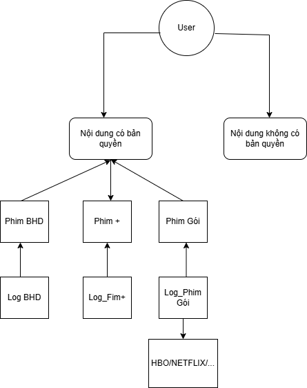
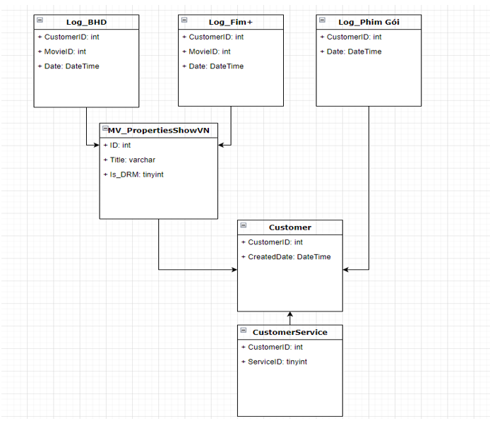

# BÁO CÁO TÌNH HÌNH CẤP KEY DRM TỪ 06/2019 - 08/2022
---
# Tổng quan
---
Hiện nay, việc giám sát và dự báo số lượng key DRM được sử dụng cho việc mã hóa nội dung là một vấn đề quan trọng không chỉ đối với đội ngũ Giải pháp Kỹ thuật mà còn đối với các phòng ban khác trong công ty, vì nó liên quan trực tiếp đến chi phí và kế hoạch kinh doanh của FPT Television. Tuy nhiên, mặc dù vấn đề này rất quan trọng, hiện tại chúng ta vẫn thiếu một bảng điều khiển BI hoặc báo cáo định kỳ về tình hình này. Vì vậy, báo cáo này được thực hiện với mục đích cung cấp thông tin chính xác về tình hình cấp phát key và dự báo số lượng key sẽ được cấp trong tương lai.

# 2. Quy trình cấp phát Key DRM
---
* Người dùng mua sản phẩm số hoặc đăng ký dịch vụ, hệ thống DRM sẽ cấp một key duy nhất cho người đó.
* Key này có thể liên kết với thông tin tài khoản người dùng hoặc thiết bị cụ thể, đảm bảo rằng chỉ người dùng đã đăng ký mới có thể sử dụng sản phẩm.
* Các key này có thể có thời hạn sử dụng, giới hạn theo số lần sử dụng, hoặc chỉ có thể sử dụng trên một số thiết bị nhất định.

# Conceptual Map

---
# Data Model

---

